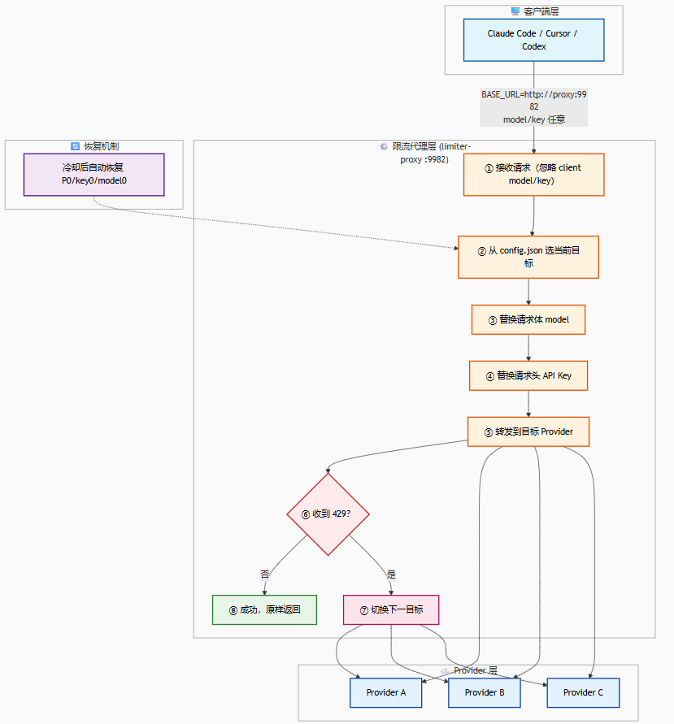
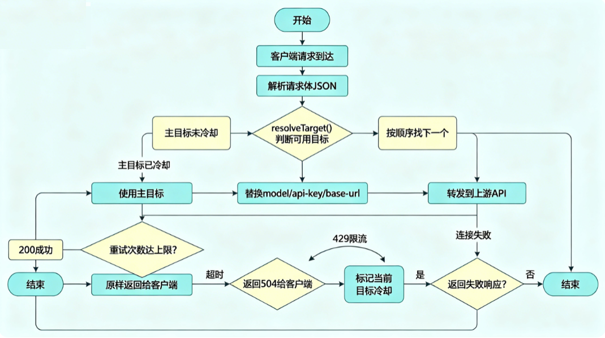

# llm-team-proxy-switcher

[English](README_EN.md) | **中文**

## 📌 这是什么？

**llm-team-proxy-switcher** 是一个部署在团队内网的轻量级 LLM API 代理，解决 AI 编程工具（Claude Code、Codex 等）在使用第三方 API 时频繁遇到限流报错的问题。

你只需要在团队服务器上运行这个代理，所有成员的 CLI 工具指向它，即可自动获得**多 Key 轮询 + 多模型切换 + 限流自动恢复**的能力。

> Just kill **"API Error: Request rejected (429) · usage allocated quota exceeded. please try again later."**

## 🔥 解决什么问题？

| 痛点 | 本项目的解决方案 |
|------|----------------|
| ❌ 单个 API Key 频繁触发 429 限流 / 524 超时 / 529 服务繁忙 | ✅ 多个 Key 自动轮询，叠加团队配额 |
| ❌ 限流后直接报错，中断工作流 | ✅ 自动切换到备用 Key / 备用模型，无感切换 |
| ❌ 团队成员各自部署代理，维护成本高 | ✅ 一台服务器部署，全团队共享 |
| ❌ 不同成员用不同 Provider / 不同模型 | ✅ 每个 Provider 独立配置 base-url、key、模型列表 |
| ❌ 限流恢复后需要手动切回主模型 | ✅ 冷却到期自动恢复首选配置 |
| ❌ 需要安装额外依赖或复杂环境 | ✅ 零依赖，`node proxy.js` 即可运行 |
| ❌ 配置修改后需要重启服务 | ✅ config.json 热更新，保存即生效 |

不想用CC Switch，那么现在，这个工具选择应该算不错！
<div align="center">

### 🌟 如果这个项目对你有帮助，请 Star ⭐ 支持一下！您的支持是我持续更新的动力！thx！

</div>


## ✨ 核心特性

- **二维轮询矩阵** — Provider × Model 组合自动轮询，一个维度耗尽自动切换另一个维度
- **团队配额叠加** — N 个成员的 API Key = N 倍可用配额，最大化利用 Coding Plan 套餐
- **独立冷却追踪** — 每个 (Provider, Model) 组合独立追踪限流状态，互不影响
- **自动恢复** — 冷却时间到期后自动切回首选 Provider + 首选 Model
- **透明代理** — 不修改客户端任何配置，仅需改一个环境变量 `*_BASE_URL`
- **多 CLI 兼容** — 支持 Claude Code、Codex、Cursor 等任何 OpenAI / Anthropic 兼容客户端
- **Web UI 管理** — 内置主页（实时状态）+ 配置编辑器（JSON 编辑 + 校验 + 保存）+ CLI 配置指南
- **认证格式兼容** — 同时支持 `Authorization: Bearer` 和 `x-api-key`，自动检测并替换
- **流式响应支持** — 完整支持 SSE streaming，不影响打字体验
- **零依赖** — 纯 Node.js 内置模块，无需 `npm install`，单文件即可运行


## 🎯 为什么需要这个工具？

市面上的 LLM 代理工具大多面向 **Token 计费**的通用场景，功能全面但配置复杂——需要数据库、Docker、管理后台，部署门槛高。

**本工具专为 Coding Plan 套餐用户定制。** 如果你和团队成员各自购买了 Claude Code / Codex 的 Coding Plan 套餐，每人有独立的 API Key 和配额，那么你们需要的不是一个功能臃肿的 LLM 网关，而是一个**足够简单、足够轻量、能叠加团队配额的限流切换代理**。

这正是本项目要做的事：**一个 JSON 配置文件 + 一个 JS 文件 + 一条启动命令**，即可让整个团队共享所有成员的 Coding Plan 配额，429 限流 / 524 超时 / 529 服务繁忙时自动无缝切换。

> 💡 **一句话优势：** 零依赖、单文件、秒级部署，不做 Token 计费，只做 Plan 套餐的配额叠加和限流切换——用最少的代码解决最痛的问题。

与同类工具相比，本项目的核心差异：

| 维度 | 通用 LLM 代理工具 | 本项目 |
|------|------------------|--------|
| 定位 | Token 计费 / 通用 LLM 网关 | **Coding Plan 套餐限流切换** |
| 依赖 | 数据库 + 框架 + Docker | **零依赖，`node proxy.js` 即可** |
| 部署 | 分钟级，需配置 DB / 后台 | **秒级，一个 JSON 配置搞定** |
| 团队管理 | 用户 / 角色 / 令牌 / 账单 | **不需要——团队成员直接用** |
| 学习成本 | 高（概念多、文档厚） | **极低（看 README 5 分钟上手）** |


## 🛠️ 支持的工具

| 工具 | 状态 | 说明 |
|------|------|------|
| **Claude Code** | ✅ 已支持 | 完整支持，已验证 |
| **Codex (OpenAI)** | ✅ 已支持 | OpenAI 兼容格式，原理相同 |
| **Cursor** | 🔜 计划中 | 原理相同，待验证 |
| **OpenClaw** | ✅ 已支持 | 自动剥离 provider 前缀（如 bailian/qwen3.7-plus）|
| 其他 OpenAI / Anthropic 兼容 CLI | ✅ 已支持 | 任何支持自定义 API Base URL 的客户端均可使用 |

## 工作原理

### 架构概览



### Claude Code 需要改哪些配置？

Claude Code 只需要修改 **3 个环境变量**（都指向代理，不涉及真实 API 信息）：

```json
{
  "ANTHROPIC_BASE_URL": "http://proxy:9982",
  "ANTHROPIC_API_KEY": "dummy",
  "ANTHROPIC_MODEL": "qwen3.7-plus"
}
```

| 变量 | 值 | 说明 |
|------|-----|------|
| `ANTHROPIC_BASE_URL` | 代理地址 | Claude Code 的所有请求都发给代理 |
| `ANTHROPIC_API_KEY` | 任意非空值 | **必须非空**，否则 Claude Code 会要求 OAuth 登录。代理会用真实 key 替换它 |
| `ANTHROPIC_MODEL` | 任意模型名 | 代理会用 config.json 中的模型替换它 |

**真实的 base-url、api-key、model 全部在代理的 config.json 中配置**，Claude Code 完全不知道。

### 代理在请求层做了什么？

Claude Code 发送请求到代理时，HTTP 请求长这样：

```http
POST /v1/messages?beta=true HTTP/1.1
Host: 192.168.23.145:9982
x-api-key: dummy
authorization: Bearer dummy
anthropic-version: 2023-06-01
Content-Type: application/json

{"model": "qwen3.7-plus", "messages": [...]}
```

代理拦截后，执行以下替换：

**1. 清理并替换认证头**
- 删除所有原始 auth header（`x-api-key`、`authorization`、`x-auth-token`）
- 注入真实 API Key，同时设置两种格式：
  - `x-api-key: sk-真实key`
  - `authorization: Bearer sk-真实key`
- 保留 `anthropic-version` 等非认证头

**2. 替换模型名**
- 将 `body.model` 从客户端的模型名替换为 config.json 中当前 Provider 的模型

**3. 拼接真实 API 地址**
- 将 Provider 的 `base-url` 与请求路径正确拼接（保留 base-url 的路径部分）
- 例：`https://opencode.ai/zen/go` + `/v1/messages?beta=true`
- 结果：`https://opencode.ai/zen/go/v1/messages?beta=true`

替换后的请求发给真实 API：

```http
POST /zen/go/v1/messages?beta=true HTTP/1.1
Host: opencode.ai
x-api-key: sk-真实的key
authorization: Bearer sk-真实的key
anthropic-version: 2023-06-01

{"model": "qwen3.7-plus", "messages": [...]}
```

**4. 处理模型验证**
- Claude Code 启动时会发送 `GET /v1/models` 验证模型是否可用
- 代理返回 config.json 中所有配置的模型列表，让验证通过

### 为什么不直接改 Claude Code 的 API Key？

因为代理的核心价值在于**运行时动态切换**：

- 直接配置：只能用固定的一个 key + 一个 model，429 / 524 / 529 了就直接报错
- 通过代理：代理自动在多个 key + 多个 model 之间轮询，429 / 524 / 529 了无缝切换

Claude Code 不需要知道有多少个 key、多少个模型、当前用的哪个——这些全部由代理管理。

### 二维轮询矩阵

轮询空间是一个二维矩阵：**Provider × Model**。

```
配置：
  P0: key-A, models: [qwen3.7-plus, qwen-turbo]
  P1: key-B, models: [qwen3.6-plus, glm5.2]
  P2: key-C, models: [qwen3.5-plus, deepseek-v4-pro]

展开为扁平目标列表（按顺序尝试）：
  [0] P0/qwen3.7-plus    ← 默认首选
  [1] P0/qwen-turbo
  [2] P1/qwen3.6-plus
  [3] P1/glm5.2
  [4] P2/qwen3.5-plus
  [5] P2/deepseek-v4-pro
```

**轮询规则（动态队列算法）：**
1. 初始队列按配置顺序排列：P0/m0 → P0/m1 → P1/m0 → P1/m1 → ...
2. 每次请求取队头第一个未冷却的目标
3. 目标报错（429/524/529）→ 进入冷却 → **移到队列末尾**
4. 每隔 `p0-reset-interval-seconds`（默认 600s），P0 所有目标**重置到队列最前面**
5. 冷却到期后目标仍可被轮询到，P0 因定期回归队头而保持最高优先级

**冷却追踪粒度：** 每个 (Provider, Model) 组合独立追踪。P0 的 key 被限流不影响 P1 的 key。

### 认证格式兼容

代理自动检测并替换请求中的认证头，支持两种格式：

```
OpenAI 兼容格式:  Authorization: Bearer sk-xxx
Anthropic 格式:   x-api-key: sk-xxx
```

当切换 Provider 时，代理用新 Provider 的 `api-key` 替换对应的认证头。如果原始请求两种头都有，两种都会被替换。

### 请求生命周期



### 为什么用代理而不是 Claude Code 插件？

Claude Code 的 hooks 只能拦截工具调用（PreToolUse/PostToolUse）和注入上下文，**无法拦截底层 API 传输层的 429 / 524 / 529 错误**。429 发生在 Claude Code 内部与 API 的通信层，对插件完全不可见。

代理方案的优势：
- **完全透明**：不修改 Claude Code 的任何文件
- **跨工具通用**：Cursor、Codex、任何支持自定义 API 地址的客户端都能用
- **团队共享**：部署一台服务器，所有人用同一个代理
- **实时生效**：修改 config.json 即刻生效，无需重启任何客户端

## Claude Code / CLI 配合使用的完整流程

以下是从启动到实际对话的完整步骤，解释每个环节发生了什么。

### 第一步：启动代理

```bash
cd llm-team-proxy-switcher

# 前台运行（推荐调试用）
start.bat                    # Windows
./start.sh                   # Linux / macOS

# 后台运行（Linux / macOS，推荐服务器使用）
nohup ./start.sh -d &        # 后台启动，日志输出到 ./log/llm-proxy.log
./start.sh --stop            # 停止后台运行的代理
./start.sh --restart         # 重启后台代理（停止后重新后台启动）

# 或直接运行
node proxy.js
```

> **日志自动归档：** 日志文件超过 200MB 时自动归档为带时间戳的文件（如 `llm-proxy-20260618-193000.log`），当前日志重新开始写入。

代理启动后：
- 监听在 `0.0.0.0:9982`（内网所有成员可访问）
- 从 `config.json` 加载所有 Provider 配置（base-url、api-key、models）
- 构建二维轮询矩阵：`[P0/model0, P0/model1, P1/model0, P1/model1, ...]`
- 启动 Web UI（主页 `/`，配置页 `/config.html`）
- 开始监听 config.json 变化（热更新）

### 第二步：配置 Claude Code

在 Claude Code 的 `settings.json` 中设置：

```json
{
  "env": {
    "ANTHROPIC_BASE_URL": "http://192.168.23.145:9982",
    "ANTHROPIC_API_KEY": "proxy",
    "ANTHROPIC_MODEL": "qwen3.7-plus"
  }
}
```

这里的关键：
- `ANTHROPIC_BASE_URL` 指向代理地址，而非真实 API 地址
- `ANTHROPIC_API_KEY` 设为任意非空值（代理会替换为真实 key）
- `ANTHROPIC_MODEL` 设为任意模型名（代理会替换为配置的模型）

**Claude Code 不知道代理的存在——它以为自己在直接调用 API。**

### 第三步：Claude Code 启动并验证

Claude Code 启动时会做以下操作：

1. **读取配置** — 从环境变量获取 base-url、api-key、model
2. **验证模型** — 发送 `GET /v1/models` 到代理，检查模型是否可用
3. **代理响应** — 代理返回 config.json 中所有配置的模型列表
4. **验证通过** — Claude Code 确认模型可用，进入就绪状态

### 第四步：用户发送消息

当用户在 Claude Code 中输入消息并发送时：

```
用户输入: "帮我写一个函数"
```

Claude Code 构造 HTTP 请求：

```http
POST /v1/messages?beta=true HTTP/1.1
Host: 192.168.23.145:9982
x-api-key: proxy
anthropic-version: 2023-06-01
Content-Type: application/json

{
  "model": "qwen3.7-plus",
  "max_tokens": 8192,
  "messages": [{"role": "user", "content": "帮我写一个函数"}]
}
```

### 第五步：代理处理请求

代理收到请求后执行以下流程：

1. **选择目标** — 调用 `resolveTarget()`，从轮询矩阵中选择当前可用的目标
   - 首次请求 → 选择 P0 的第一个模型（默认首选）
   - 如果 P0 在冷却中 → 选择下一个非冷却的目标

2. **替换 model** — 将请求体中的 `"model": "qwen3.7-plus"` 替换为目标 Provider 配置的模型名

3. **替换 auth** — 删除所有原始 auth header（`x-api-key`、`Authorization`），注入目标 Provider 的真实 API Key

4. **构造上游 URL** — 将目标 Provider 的 `base-url` 与请求路径拼接
   - 例：`https://opencode.ai/zen/go` + `/v1/messages?beta=true`
   - 结果：`https://opencode.ai/zen/go/v1/messages?beta=true`

5. **转发请求** — 将修改后的请求发送到上游 API

### 第六步：处理响应

**情况 A：成功（200）**
- 代理将上游响应原样返回给 Claude Code
- Claude Code 显示 AI 回复给用户
- 用户看到的和正常使用完全一样

**情况 B：限流/超时/繁忙（429/524/529）**
- 代理将当前目标标记为冷却（进入 `limiter-recovery-seconds` 倒计时）
- 自动选择轮询矩阵中的下一个目标
- 用新目标的 model + api-key + base-url 重新构造请求
- 再次转发给上游
- 重复此过程直到成功或所有目标耗尽

**情况 C：连接失败**
- 与 429 类似，标记当前目标冷却，切换到下一个

### 第七步：冷却恢复

当某个被限流的目标冷却时间到期：
- 代理自动将其从冷却列表中移除
- 下一次请求时，如果它是矩阵中的首选目标，自动恢复使用
- 日志输出：`↻ Primary recovered → P0/qwen3.7-plus`

### 其他 CLI 工具的配置方式

所有 CLI 工具的使用原理相同——将 API Base URL 指向代理地址，代理透明处理模型切换和 Key 轮询。以下是各工具的具体配置方法。

#### Claude Code（✅ 已验证）

```jsonc
// ~/.claude/settings.json
{
  "env": {
    "ANTHROPIC_BASE_URL": "http://192.168.23.145:9982",
    "ANTHROPIC_API_KEY": "dummy",
    "ANTHROPIC_MODEL": "qwen3.7-plus"
  }
}
```

- `ANTHROPIC_API_KEY` 必须非空（任意值，代理会替换）
- `ANTHROPIC_MODEL` 设为 config.json 中任一已配置的模型名

#### Codex / OpenAI CLI（✅ 已支持）

Codex 使用 OpenAI 兼容格式，配置方式：

```bash
# 环境变量方式
export OPENAI_BASE_URL=http://192.168.23.145:9982/v1
export OPENAI_API_KEY=dummy
```

或在 Codex 配置文件中：

```toml
# ~/.codex/config.toml
[api]
base_url = "http://192.168.23.145:9982/v1"
api_key = "dummy"
```

- 注意 URL 末尾需要 `/v1`（OpenAI 格式标准路径）
- `OPENAI_API_KEY` 必须非空（代理会替换）

#### Cursor（🔜 待验证）

在 Cursor 设置中配置：

1. 打开 Cursor Settings → Models
2. 找到 **Override OpenAI Base URL**
3. 填入：`http://192.168.23.145:9982/v1`
4. 设置 OpenAI API Key 为任意非空值

#### OpenClaw（✅ 已验证）

OpenClaw 使用 Coding Plan key 时必须配置为 **Anthropic 格式**：

```json
{
  "models": {
    "providers": {
      "bailian": {
        "baseUrl": "http://<proxy-ip>:9982/v1",
        "apiKey": "dummy",
        "api": "anthropic-messages",
        "models": [
          { "id": "qwen3.7-plus", "name": "qwen3.7-plus", ... },
          { "id": "qwen3.6-plus", "name": "qwen3.6-plus", ... }
        ]
      }
    }
  },
  "agents": {
    "defaults": {
      "model": { "primary": "qwen3.7-plus" },
      "models": {
        "qwen3.7-plus": {},
        "qwen3.6-plus": {}
      }
    }
  }
}
```

> **注意：** Coding Plan 的 `sk-sp-` 开头 key 仅支持 Anthropic 格式接口（`api: "anthropic-messages"`），不支持 OpenAI 格式（`api: "openai-completions"`）。代理会自动剥离 provider 前缀（如 `bailian/qwen3.7-plus` → `qwen3.7-plus`）并替换 API Key。

#### 通用配置（任何 OpenAI / Anthropic 兼容客户端）

**OpenAI 格式客户端：**
```
Base URL:  http://<proxy-ip>:9982/v1
API Key:   dummy（任意非空值）
```

**Anthropic 格式客户端：**
```
Base URL:  http://<proxy-ip>:9982
API Key:   dummy（任意非空值）
```

**关键点：**
- 所有客户端共享同一个代理，无需多处部署
- 代理自动处理认证头格式（`Authorization: Bearer` 和 `x-api-key` 都支持）
- 代理自动处理模型验证（`GET /v1/models` 返回已配置的模型列表）
- 代理自动处理 429 / 524 / 529 限流 / 524 超时 / 529 服务繁忙切换，对客户端完全透明

### 团队多人使用的流程

```
管理员操作：
  1. 在开发服务器上运行 node proxy.js
  2. 在 config.json 中配置所有成员的 API Key（每人一个 Provider）
  3. 通过 Web UI (http://server:9982/config.html) 可随时修改配置

成员操作：
  1. 在 settings.json 中设置 ANTHROPIC_BASE_URL=http://server:9982
  2. 设置 ANTHROPIC_API_KEY=dummy（任意非空值）
  3. 正常使用 Claude Code

代理自动处理：
  - 所有成员的请求共享同一组 API Key 池
  - 某个 Key 被限流 → 自动切换到其他 Key
  - 所有 Key 都被限流 → 按模型维度继续轮询
  - 配额叠加：3 个 Key = 3 倍可用配额
```

## 快速开始

### 1. 编辑 config.json

```json
{
  "limiter-recovery-seconds": 300,

  "providers": [
    {
      "base-url": "https://opencode.ai/zen/go",
      "api-key": "sk-成员A的key",
      "models": ["qwen3.7-plus", "qwen-turbo"]
    },
    {
      "base-url": "https://opencode.ai/zen/go",
      "api-key": "sk-成员B的key",
      "models": ["qwen3.6-plus", "glm5.2"]
    },
    {
      "base-url": "https://dashscope.aliyuncs.com/compatible-mode",
      "api-key": "sk-成员C的key",
      "models": ["qwen3.5-plus", "deepseek-v4-pro"]
    }
  ]
}
```

每个 provider 可以有**不同的 base-url、api-key 和可用模型列表**。

完整配置项：

| 字段 | 默认值 | 说明 |
|------|--------|------|
| `providers` | _(必填)_ | Provider 配置数组 |
| `[].base-url` | — | 该 Provider 的 API 地址 |
| `[].api-key` | — | 该 Provider 的 API Key |
| `[].models` | — | 该 Provider 可用模型列表（按优先级排列） |
| `limiter-recovery-seconds` | `300` | 限流冷却恢复时间（秒） |
| `p0-reset-interval-seconds` | `600` | P0 目标重置到队列头部的间隔（秒） |
| `port` | `9982` | 代理监听端口 |
| `bind` | `0.0.0.0` | 监听地址（`0.0.0.0` = 内网可访问，`127.0.0.1` = 仅本机） |
| `maxRetries` | `20` | 每次请求最大轮询次数 |
| `requestTimeoutMs` | `300000` | 上游请求超时（毫秒） |

### 2. 设置环境变量

每位团队成员在各自的 Claude Code 中配置 `ANTHROPIC_BASE_URL` 指向代理服务器：

```bash
# 假设代理部署在内网服务器 192.168.1.100
# Windows (PowerShell)
$env:ANTHROPIC_BASE_URL = "http://192.168.1.100:9982"

# Linux / macOS
export ANTHROPIC_BASE_URL=http://192.168.1.100:9982
```

或在 Claude 的 `settings.json` 的 `env` 中永久设置：

```jsonc
// C:\Users\<用户名>\.claude\settings.json
{
  "env": {
    "ANTHROPIC_BASE_URL": "http://192.168.1.100:9982"
  }
}
```

### 3. 启动代理

**方式一：一键启动脚本（推荐）**

```bash
# Windows
start.bat

# Linux / macOS
./start.sh
```

脚本会自动检测 Node.js 环境、检查配置文件，然后启动代理。

**方式二：直接运行**

```bash
node proxy.js
```

启动后显示：

```
╔════════════════════════════════════════════════════════╗
║   llm-team-proxy-switcher v1.0.0                      ║
║   Provider + model rotation on rate limiting            ║
╚════════════════════════════════════════════════════════╝

  Proxy:      http://127.0.0.1:9982
  Providers:  3
  Targets:    6
  Recovery:   300s

  P0: sk-成员A的key...  https://opencode.ai/zen/go
      models: qwen3.7-plus, qwen-turbo
  P1: sk-成员B的key...  https://opencode.ai/zen/go
      models: qwen3.6-plus, glm5.2
  P2: sk-成员C的key...  https://dashscope.aliyuncs.com/compatible-mode
      models: qwen3.5-plus, deepseek-v4-pro
```

### 4. 验证

```bash
curl http://127.0.0.1:9982/
```

## 运行时行为

### 正常请求
```
14:41:47 → POST /v1/messages model=qwen3.7-plus [P0]
14:41:48 ← 200 P0/qwen3.7-plus (2048B)
```

### 限流触发轮询
```
14:42:00 → POST /v1/messages model=qwen3.7-plus [P0]
14:42:01 ⬤ P0/qwen3.7-plus → cooldown 300s
14:42:01 ⇄ P0/qwen3.7-plus rate-limited → P0/qwen-turbo
14:42:02 ⬤ P0/qwen-turbo → cooldown 300s
14:42:02 ⇄ P0/qwen-turbo rate-limited → P1/qwen3.6-plus
14:42:03 ← 200 P1/qwen3.6-plus (1024B)
```

### 自动恢复
```
14:47:01 ↻ Primary recovered → P0/qwen3.7-plus
```

## 团队部署

将代理部署在一台内网服务器上，所有团队成员共享使用：

```
内网服务器 (192.168.1.100)
├── proxy.js      ← bind: 0.0.0.0（允许内网访问）
├── config.json   ← 团队共享的 Provider 配置
└── public/       ← Web UI

成员A 电脑: Claude Code → ANTHROPIC_BASE_URL=http://192.168.1.100:9982
成员B 电脑: Claude Code → ANTHROPIC_BASE_URL=http://192.168.1.100:9982
成员C 电脑: Claude Code → ANTHROPIC_BASE_URL=http://192.168.1.100:9982
```

**配置说明：**
- `config.json` 中配置所有团队成员的 API Key，每个成员作为一个 Provider
- `bind` 设为 `"0.0.0.0"` 以允许内网访问（默认已设置）
- 每位成员只需在 Claude Code 中设置 `ANTHROPIC_BASE_URL` 即可

**团队配额叠加：**
```
成员A: sk-aaa → RPM:600, TPM:5M  (独立配额)
成员B: sk-bbb → RPM:600, TPM:5M  (独立配额)
成员C: sk-ccc → RPM:600, TPM:5M  (独立配额)

团队总可用 = 3 × 单 Key 配额
```

## 安全说明

- 代理默认监听 `0.0.0.0`（内网可访问），如需限制本机使用可改为 `127.0.0.1`
- 不存储请求日志，不记录请求体
- API Key 仅在转发时注入请求头，不持久化
- 启动面板和 Web UI 仅显示 Key 前 10 位
- Web UI 配置页可查看完整 API Key，**建议仅在内网使用，不要暴露到公网**

## 故障排除

### 代理启动失败
```
✗ No providers configured in config.json
```
确认 `config.json` 中至少配置了一个 provider。

### 连接被拒绝
确保代理正在运行（`node proxy.js`），且 `ANTHROPIC_BASE_URL=http://127.0.0.1:9982`。

### 配置热更新
修改 `config.json` 后无需重启代理，自动生效。


## Changelog

### 2026-06-23

- **新增动态队列轮询算法**：
  - 报错目标移到队列末尾，所有目标轮流尝试
  - P0 目标每隔 `p0-reset-interval-seconds`（默认 600s）重置到队列头部，保持最高优先级
  - 冷却机制保留：报错后短暂冷却，避免立即重试
- 新增 524、529 状态码自动切换：
  - `429`：配额/请求频率超限
  - `524`：上游服务响应超时
  - `529`：上游服务繁忙或过载
- 上述状态码会让当前目标进入冷却，并自动切换到下一个 Provider / Model。

## License

[Apache License 2.0](LICENSE)

---

<div align="center">

**Author:** [endcy](https://github.com/endcy)  
**GitHub:** [https://github.com/endcy/llm-team-proxy-switcher](https://github.com/endcy/llm-team-proxy-switcher)

如果这个项目对你有帮助，欢迎 Star ⭐ 支持！

</div>
